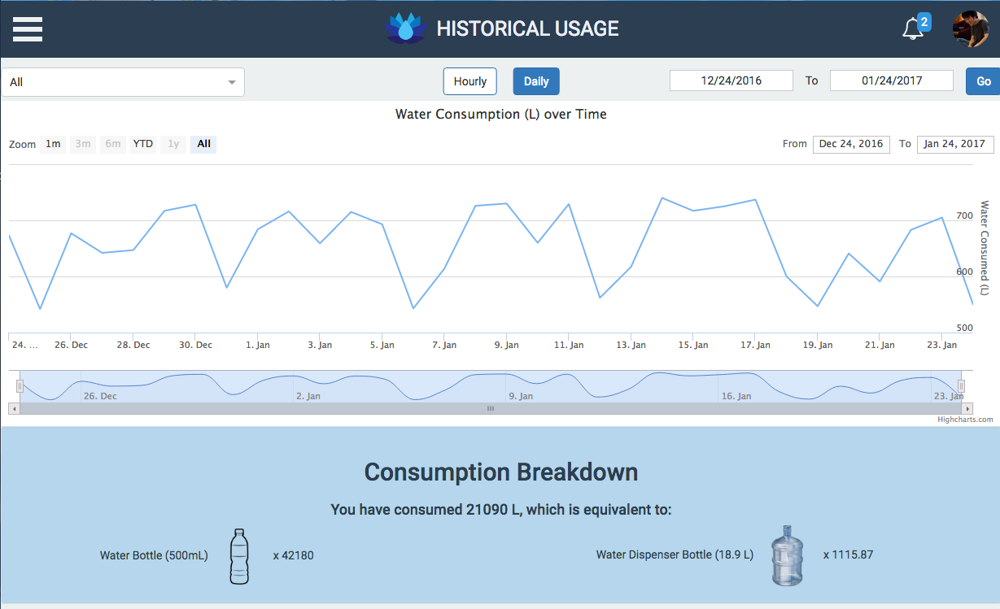
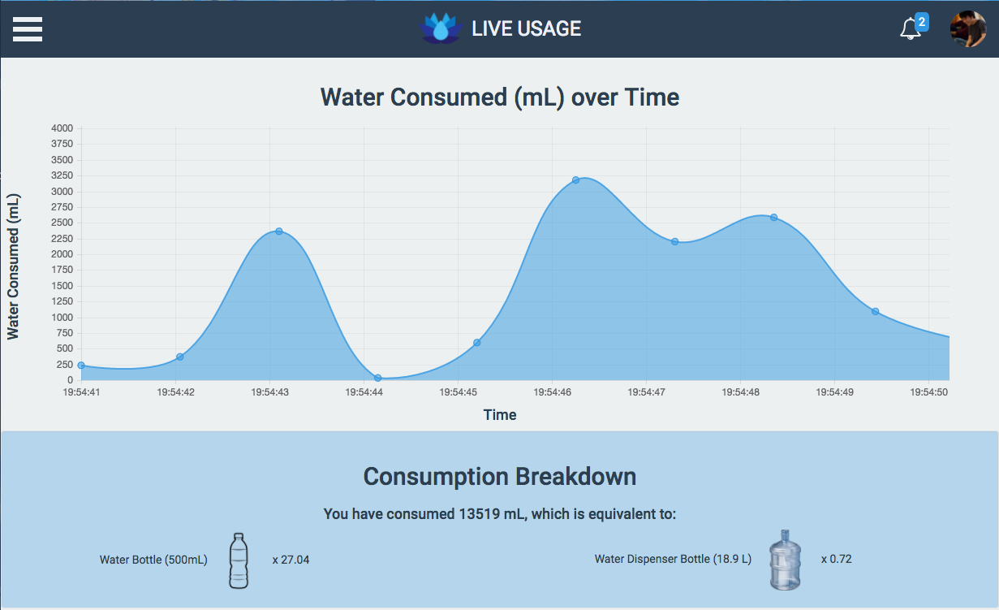
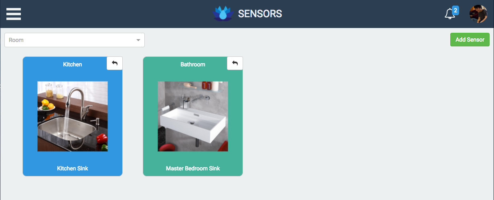
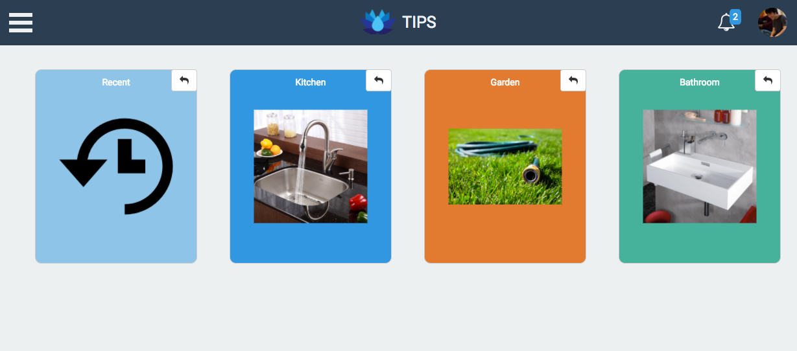
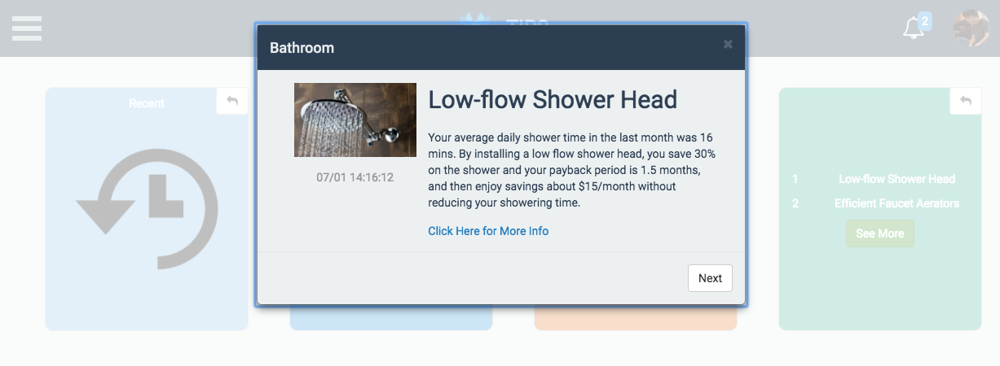
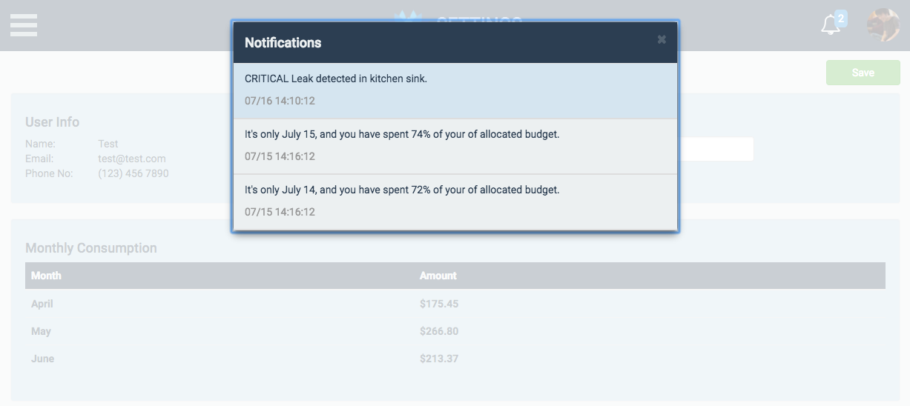
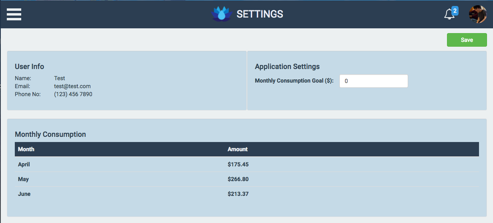

# WaterBud - Helping you and the Environemnt

**Note: This project's purpose is to help consumers track their water usage and reduce their water waste by attaching sensors to the outlet of each faucet.**

This repository contains the following:
- Logic to retrieve water flow from sensors
- Add, Edit, and Remove additional sensors
- Review Historical Water Usage
- Realtime Water Usage Report
- Tips and Recommendation to reduce Water waste
- User defined threshold (expressed in Dollars)

##Tech Stack:

###FrontEnd
- React
- Redux
- Bootstrap
- Less

###BackEnd
- Python
- Mongodb
- Tornado

##How To Run
**Note: This will generate fake live data**
python app/app.py
python pi/scripts/sensor_websocket.py
python pi/scripts/sensor_poc.py

##Screenshots

